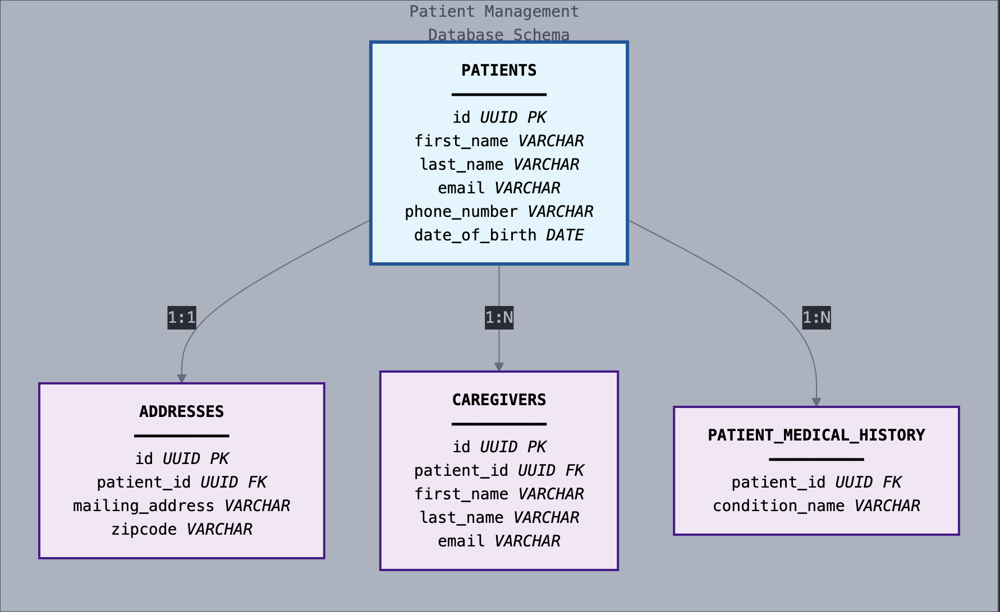
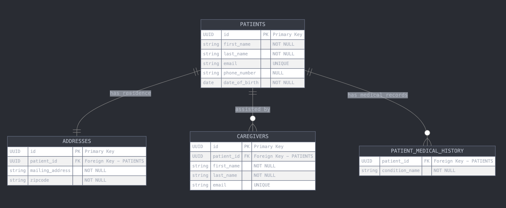

# Patient Service - Backend Documentation
This document provides a comprehensive technical overview of the Patient Management backend service. It details the architectural design, database schema, API endpoints, and key business logic.

## Technology Stack
This service is built using a Java-based stack:

```
Java: The core programming language.
Spring Boot: The application framework, providing dependency injection, web services, and data access.
Spring Data JPA (Hibernate): For object-relational mapping (ORM) to interact with the database.
PostgreSQL: A powerful open-source relational database.
Maven: For project build and dependency management.
MapStruct: For high-performance, compile-time mapping between DTOs and entities.
Liquibase: For version-controlled database schema migrations.
Docker: For containerizing the application and its dependencies for consistent environments.
```

## Architectural Design
The service is built on a classic Layered Architecture to ensure a strong separation of concerns, making the application maintainable, scalable, and easy to test.

### Controller Layer: 
Exposes the RESTful API endpoints. Its only job is to handle HTTP requests, validate incoming data, and delegate business logic to the Service layer. It knows nothing about the database.

### Service Layer: 
Contains all the core business logic. It orchestrates operations, enforces business rules (like duplicate checks), and handles transactions. It is completely independent of the web layer.

### Repository Layer: 
An abstraction over the database. It provides data access methods (e.g., findById, save, custom search queries) and is implemented by Spring Data JPA.

### Design Choices & Patterns
#### Data Transfer Objects (DTOs): 
We use DTOs (PatientDTO, CaregiverDTO) as the data contract for our API. This is a critical design choice that decouples our external API from our internal database structure. It prevents clients from being exposed to our database entities and protects against mass assignment vulnerabilities.

#### Mappers (MapStruct): 
To avoid tedious and error-prone manual mapping between DTOs and entities, we use MapStruct. It generates highly optimized, compile-time mapping code, which is significantly faster and safer than reflection-based mappers.

#### Dependency Injection: 
Spring's DI framework manages the lifecycle of our components (@Service, @Repository, etc.) and injects dependencies where needed (e.g., injecting the PatientRepository into the PatientService). This promotes loose coupling and makes testing easier.

## Database Design
The database is designed to be normalized, ensuring data integrity and minimizing redundancy.

### Database Schema
This diagram shows the main tables and how they are interconnected. The PATIENTS table is the central entity, with other tables linking to it via the patient_id foreign key.



### Entity-Relationship Diagram (ERD)
This diagram provides a more formal view of the table relationships.



### Design Choices
#### Separate Tables: 
Caregivers and patient_medical_history are in separate tables with a foreign key (patient_id) linking back to the patients table. This is the correct way to model a one-to-many relationship and is implemented in JPA using @OneToMany and @ElementCollection.

#### Indexes: 
We've created indexes on first_name, last_name, email, and phone_number in the patients table. Why? Indexes act like a table of contents for the database. Without them, a search query would have to scan every single row in the table (a "full table scan"), which is very slow for large datasets. With indexes, the database can quickly look up the location of the matching rows, resulting in significantly faster search performance.

#### UUIDs as Primary Keys: 
Using UUIDs instead of sequential integers prevents attackers from guessing record IDs and makes the system easier to scale in a distributed environment.

#### Database Migrations (Liquibase): 
All schema changes are managed through Liquibase scripts. This provides version control for the database, ensuring that the schema is consistent across all developer machines and deployment environments.

#### Why We Used Liquibase
Using a tool like Liquibase is a professional best practice that provides version control for your database schema. While it's convenient to let Hibernate create the schema automatically during development (ddl-auto: update), this approach is unsafe for production.

Think of it this way: Git is to your code as Liquibase is to your database.

The key benefits are:

##### Consistency: 
It guarantees that the database schema is identical in every environment (your machine, your teammate's machine, testing, and production). This eliminates "it works on my machine" bugs caused by database differences.

##### Traceability: 
Every change to the database (adding a table, creating an index) is recorded in a script file and checked into version control. You have a complete, auditable history of who changed what, when, and why.

##### Safety and Control: 
You write the exact changes you want. Unlike Hibernate's update feature, which can sometimes make unexpected or destructive changes (like dropping a column and losing data), you are in full control.

##### Automation: 
Database migrations become a seamless part of your automated CI/CD pipeline. When you deploy a new version of your app, the database is automatically and reliably updated with it.

## API Endpoints
The service exposes the following RESTful endpoints under the base path /api/patients.

| Method   | URL                         | Description                                                               | Request Body | Response                            |
| :------- | :-------------------------- | :------------------------------------------------------------------------ | :----------- | :---------------------------------- |
| `POST`   | `/`                         | Creates a new patient record.                                             | `PatientDTO` | `201 Created` with the new `Patient`  |
| `GET`    | `/{id}`                     | Retrieves the full details of a single patient by their UUID.             | None         | `200 OK` with the `Patient` object    |
| `GET`    | `/search?term={searchTerm}` | Searches for patients by first name, last name, email, or phone number.   | None         | `200 OK` with a `List<Patient>`       |
| `PUT`    | `/{id}`                     | Updates an existing patient's details and synchronizes their caregivers.  | `PatientDTO` | `200 OK` with the updated `Patient`   |
| `DELETE` | `/{id}`                     | Deletes a patient and all their associated records (caregivers, etc.).    | None         | `204 No Content`                      |

## Key Business Logic
The service layer enforces several important business rules:

### Duplicate Patient Prevention: 
The system prevents the creation or update of a patient if another patient with the same first name, last name, and date of birth already exists. This is checked in the createPatient and updatePatient methods.

### Duplicate Caregiver Prevention: 
The system prevents a new caregiver from being added to a patient if another caregiver with the exact same details (name, email, phone, relationship) already exists for that same patient. This logic is enforced in the updatePatient and addCaregiverToPatient methods.

### Transactional Integrity: 
All methods that modify the database (create, update, delete) are marked as @Transactional. This ensures that all operations within the method either succeed together or fail together, preventing partial updates and keeping the database in a consistent state.
