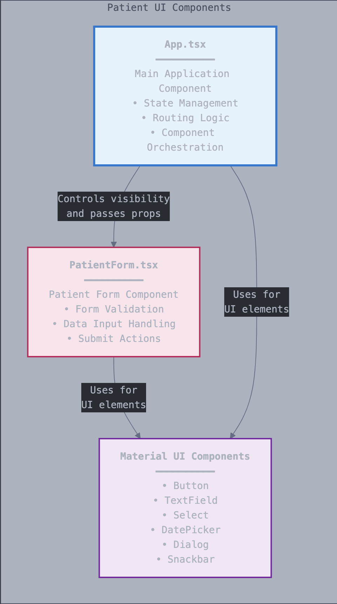

# Patient UI - Frontend Documentation
This document provides a complete technical overview of the Patient Management frontend application. It details the technology stack, architectural design, component structure, state management, and API integration.

## Technology Stack
The user interface is a modern single-page application (SPA) built with a focus on performance, type safety, and a clean user experience.

```
React: The core library for building the component-based user interface.
TypeScript: Adds static typing to JavaScript, catching errors early and improving code maintainability.
Vite: A next-generation frontend tooling system that provides a fast development server and optimized builds.
Material UI (MUI): A comprehensive library of pre-built, accessible, and customizable React components used for the entire form and layout.
Axios: A promise-based HTTP client for making requests to the backend REST API.
Lodash: A utility library providing helpful functions, specifically used here for a reliable isEqual deep comparison to detect form changes.
```

## Architectural Design
The frontend follows a Component-Based Architecture, a standard for modern React applications. This approach breaks the UI down into small, reusable, and independent pieces.

## Design Principles
Separation of Concerns: Logic is separated to keep components clean and focused.

UI Components (App.tsx, PatientForm.tsx): Responsible only for rendering the UI and handling user events.

API Logic: All communication with the backend is handled through Axios. In a larger application, this would be abstracted into a dedicated service layer (e.g., apiService.ts).

State Management: The application uses React's built-in useState hook for managing component state. State is "lifted up" to the nearest common ancestor component (App.tsx) to be shared between the search view and the form.

Component Composition: The main App.tsx component acts as a controller or "smart" component that manages the application's state and renders other "dumb" components like PatientForm.tsx, passing data down via props.

## Component Diagram
This diagram shows the relationship between the main components. App is the parent that controls which view is visible and passes data to the PatientForm.



## Component Breakdown
The application is primarily composed of two key components:

App.tsx (The Main Controller)
This component acts as the central hub of the application. Its responsibilities include:

View Routing: Manages the view state ('home', 'add', 'edit') to determine which part of the application is currently visible to the user.

State Management: Holds the primary application state, including the search term, the list of search results (patients), and any API success or error messages.

API Calls: Initiates API requests for searching and deleting patients.

Event Handling: Contains the handler functions for search, delete, and navigating between views.

PatientForm.tsx (The Reusable Form)
This is a versatile component used for both creating and editing patient records.

Data Entry: Renders all the form fields, including text inputs, dropdowns, and the dynamic caregiver section.

Props-Driven Behavior: It receives the patient data to edit as a prop (editingPatient). If this prop is null, it operates in "create" mode; otherwise, it operates in "edit" mode.

Form State: Manages its own internal state for the form fields.

Validation and Submission: Handles user input, performs a "no changes detected" check, and makes the POST (create) or PUT (update) API calls upon submission.

Callbacks: Communicates back to the App.tsx parent component via callback props (onFormSubmit, onCancel) to signal that its task is complete.

## State Management and UI Flow
The user experience is controlled by a simple state machine within the App.tsx component.

view: A string ('home', 'add', or 'edit') that dictates which component is rendered.

searchTerm: Stores the text in the search input field.

patients: An array that holds the results from a successful search API call.

apiMessage: An object ({ type: 'success' | 'error', text: string }) that holds the message to be displayed in the main alert banner after an action is performed.

User Flow:

The app starts in the 'home' view, showing the "Add New Patient" button and search bar.

Clicking "Add New Patient" changes the view to 'add', rendering the PatientForm in create mode.

Searching for a patient makes an API call and populates the patients array, which is then rendered in a list.

Clicking the "Edit" icon on a patient record changes the view to 'edit' and passes the selected patient's data to the PatientForm.

After a successful create, update, or delete operation, the returnToHome function is called. This function resets the view to 'home', clears the searchTerm and patients list, and displays a success message in the apiMessage banner, returning the user to a clean starting state.

## API Integration and Error Handling
Communication with the backend is handled exclusively by Axios.

API Calls: Each user action (search, create, update, delete) triggers a corresponding Axios request to the backend service (e.g., axios.get('/api/patients/search?term=...')).

Proxying: All requests are made to relative paths (e.g., /api/patients). The nginx.conf file in the Docker setup proxies these requests to the backend service at http://patient-service-backend:8080, which elegantly solves any CORS issues.

Error Handling: The handleSubmit function in PatientForm.tsx contains a robust try...catch block to handle API responses:

Success: On a successful response, it calls the onFormSubmit callback with a success message.

Validation Errors (400 Bad Request): If the backend returns a 400 status with a JSON object of field errors, the errors state is populated, and the messages are displayed directly under the invalid fields.

Business Logic Errors (400 Bad Request): If the backend returns a 400 status with a plain text message (e.g., "A patient with these details already exists"), that message is passed up to the main App component and displayed in the primary alert banner.

Other Errors: For network failures or other server errors, a generic error message is displayed.
